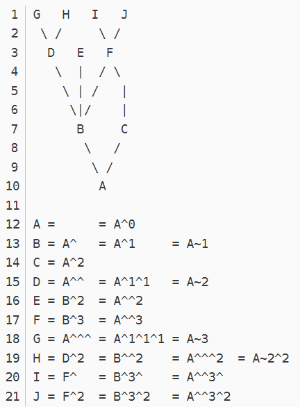

# Git

Git官方教程网址: [https://git-scm.com/book/zh/v2](https://git-scm.com/book/zh/v2)

**下载安装**

https://git-scm.com/

>  安装成功后可通命令 git --version 查看git版本号，显示则表示安装成功！


**什么是版本控制？**

> 版本控制是指对软件开发过程中各种程序代码、说明文档等文件的变更进行管理，它将追踪文件变化，记录文件的变更时间、变更内容、甚至变更执行人进行记录，同时对每一个阶段性变更（不仅仅只是一个文件的变化）添加版本编号，方便将来进行查阅特定阶段的变更信息，甚至是回滚


**人工版本控制器**

通过人工的复制行为来保存项目的不同阶段的内容，添加适当的一些描述文字加以区分

- 繁琐、容易出错
- 产生大量重复（冗余）数据


**版本控制工具**

通过程序完成上述人工版本控制行为

- 方便且功能强大
- 只记录不同版本之间变化的部分


**常见版本控制工具**

- CVS
- SVN
- Git


**Git配置**

当安装完 Git 应该做的第一件事就是设置你的用户名称与邮件地址。 这样做很重要，因为每一个 Git 的提交都会使用这些信息，并且它会写入到你的每一次提交中，不可更改

```bash
git config user.name "你的姓名"
git config user.email "你的邮箱"
```


**全局配置 -- global**

通过 `--global` 选项可以设置全局配置信息

```bash
git config --global user.name "你的姓名"
git config --global user.email "你的邮箱"
```


**检查配置**

```bash

# 查看本地git公钥
cat ~/.ssh/id_rsa.pub

# 生成SSH密钥（git公钥）
ssh-keygen -t rsa -b 4096 -C "muguilin@foxmail.com"

# 打印所有config
git config --list

# 打印指定config
git config user.name
```


**配置user信息**

 新安装好git后一定要进行的最小基本配置

| 命令                                     | 注释            |
| ---------------------------------------- | --------------- |
| git config --global user.name 'myName'   |                 |
| git config --global user.email 'myEmail' |                 |
| git config --global                      | //全局 常用     |
| git config --local                       | //本地 很少用   |
| git config --system                      | //系统 基本不用 |


**查看配置user信息**

	git config --list
	git config --list --local
	git config --list --blobal
	git config --list --system


## Git是怎么工作的？

首先，我们得先了解两个重要概念

### 1、状态

git 提供了三种（也可以说是四种）不同的记录状态

- 已修改（modified）
- 已暂存（staged）
- 已提交（committed）

有一个特殊的状态

- （Untracked）

  

### 2、区域

git 提供了三个不同的工作区，用来存放不同的内容

- 工作目录：即工作区（ 代码编辑器）没有 git add . 之前的 未追踪
- 暂存区域： git add . 之后的
- 版本库：git commit 之后的
- Git 仓库 git push 之后的


### 3、什么是版本库

> 版本库又名仓库，英文名repository，你可以简单理解成一个目录，这个目录里面的所有文件都可以被Git管理起来，每个文件的修改、删除，Git都能跟踪，以便任何时刻都可以追踪历史，或者在将来某个时刻可以“还原”。
>
> - git管理就像是一个文件系统。每commit(commit 就是 root(根) 节点) 一次就创建一棵大树 tree ，tree下有很多blob，blob就相当于叶子节点存储文件值。
>
> - 没有文件也就是没有blob对象的目录是不会被git管理的，因为git要对文件进行版本管理，所以没有必要对空目录生成对象。
>
> git log --all --graph


### 4、运行流程

> 当一个项目被 Git 初始化以后，只是表示我们希望通过 Git 来管理当前的这个项目文件的不同时期版本记录，但是这个时候项目中已存在的文件，或者以后新增的文件都是没有进入版本控制管理的，它们是 `未追踪（Untracked）` 的状态
>
> 1. 应该明白git底层的运行流程，当我们添加或者修改了文件并且add到Stage Area之后，首先会根据文件内容创建不同的blob
> 2. 当进行提交之后马上创建一个tree组件把需要的blob组件添加进去，之后再封装到一个commit组件中完成本次提交。
> 3. 在将来进行reset的时候可以直接使用git reset --hard xxxxx可以恢复到某个特定的版本
> 4. 在reset之后，git会根据这个commit组件的id快速的找到tree组件，
> 5. 然后根据tree找到blob组件，之后对仓库进行还原，整个过程都是以hash和二进制进行操作，所以git执行效率非常之高。


### 5、Git生命周期


### 6、Git使用禁忌 

**1、 禁止向集成(公共)分支执行push -f操作。**

**2、 禁止向集成(公共)分支执行变更历史的操作。**


## Git代码管理初始化方式：

#### 一、本地创建方式：

> 进入希望纳入 git 版本控制的项目目录，使用 `git init` 初始化
>
> ```bash
> git init
> ```
>
> 该命令将创建一个名为 `.git` 的子目录，这个子目录含有你初始化的 Git 仓库中所有的必须文件，这个目录也是上面我们说的三个区域之一，这个目录也是 Git 保存数据记录的地方，非常重要，如非必要，不要轻易改动

**1、已存在目项，把已有的项目代码纳入Git管理。**

1. 进入到要进行Git管理的目项的根目录。
2. 在当前目录打开，命令窗口。
3. 执行 git init //初始化git


**2、全新的项目，新建的项目直接用Git管理。**

1. 进入你常用来存放项目代码的目录。

2. git init 项目名（注：用拼音或英文，不能用中文）， 会在当前目录中创建一个以你刚才输入的项目名称 同名的文件夹。

3. 进入你创建的这个项目目录中，就可以进行相应的git操了。

   

**3、关联远程仓库**

```shell
git remote add origin 仓库地址

# 例如：
git remote add origin git@gitlab.smgtech.net:01810597/git_demo.git

# 由于远程库是空的，我们第一次推送master分支时，加上了-u参数，Git不但会把本地的master分支内容推送的远程新的master分支，还会把本地的master分支和远程的master分支关联起来，在以后的推送或者拉取时就可以简化命令。

# 例如：
git push -u origin master   以后就可以直接用 git pull 命就OK了。
```


**【重新获取】删除本地文件后 Git从远程仓库重新获取**

```shell
git fetch --all
git reset --hard 或 git reset --hard origin/test
git pull
```


#### 二、远程克隆方式：

```shell
# 语法：
git clone url --branch 分支名 克隆远程git项目的分支

# 例如：
git clone --branch test git@gitlab.smgtech.net:01810266/xuantishenbao.git
# 简写：
git clone -b test git@gitlab.smgtech.net:01810266/xuantishenbao.git


# 参数说明：
git clone url 项目名(可以在本地自定义一个分支名 或者 为空[和远程一样的名字]也行) --branch 分支名	

git clone --help # 帮助信息

git clone url 默认master分支 # 克隆远程git项目   在GitHub 上 打开项目，点击Clone or Download 按钮选择 Use HTTPS 复制项目地址
```


## 代码的提交与维护：


### 查看git状态

```shell
git status
```


### 提交代码

【注：提交】[如果在多人协作时，一定要 先拉 git pull 再推 git push]

```shell
git pull			
git pull origin test		# 从指定的远程服务器拉取
git pull --rebase			# 【推荐使用】
git fetch 					# 和 git pull功能一样，是从远程获取最新到本地，但不会自动merge，而pull会自动merge
```

**从本地将代码提交到远程仓库的步骤下如：**

#### 1、添加：到暂存区（本地）:

> 将工作区代码文件添加到暂存区

```shell
git add .			//将文件的修改，文件的新建，添加到暂存区。 跟踪 Git的暂存区
git add -u 			//将文件的修改、文件的删除，添加到暂存区。
git add -A			//将文件的修改，文件的删除，文件的新建，添加到暂存区(git add -A 等同于git add -all)。
git add *			//添加存储所有

git add 文件名			//添加存储指定改动过的文件【注：要加上文件的路径哦！, 文件要加个文件后缀名，多个文件或目录中间用 空格 隔开】
git add 文件名1 文件名2...	//添加存储指定改动过的多个文件 中间用空格分开

例如：
git add 1.txt
# 添加多个文件
git add 2.txt 3.txt
# 添加整个目录
git add ./a
# 添加多个目录
git add ./b ./c
# 添加所有文件
git add .
```


	工作中一般是用到 git add . 或者 git add -A 	//-A(-all)
	git add -A相对于git add -u命令的优点 ： 可以提交所有被删除、被替换、被修改和新增的文件到数据暂存区，而git add -u 只能操作跟踪过的文件


【文件差异对比】：

	1、比较 工作区(没add之前) 和 暂存区(add以后) 所含文件的差异
		git diff						//不指定文件时，会显示所有不同的文件，如都没差异则无任何显示！！
		git diff -- index.html css/base.css			//指定查看index.html和base.css这两个文的暂存区和 HEAD之间的差异，如没差异则无显示！！
	
	2、比较 暂存区(add后) 和 HEAD(没add) 所含文件的差异
		git diff --cached      或者	git diff —staged  	//不指定文件时，会显示所有不同的文件，如都没差异则无任何显示！！
		git diff --cached -- index.html css/base.css		//指定查看index.html和base.css这两个【多个文件之间用 空格隔开】文的暂存区和 HEAD之间的差异，如没差异则无显示！！


**从暂存区中撤销到工作区**

> 1、从暂存区(add以后) 恢复为 和 HEAD的一样，相当于取消add的操作
> 	git reset HEAD			//不指定文件时，会把暂存区所有的文件恢复到HEAD（工作区）
> 	git reset HEAD -- index.html	//指定要恢复的文件，多个文件之间用 空格隔开
>
> 2、让工作区的文件 恢复为 和 暂存区一样
> 	git checkout -- index.html	//指定要恢复的文件，多个文件之间用 空格隔开

```bash
# 从暂存区中撤销一个指定文件
git reset HEAD 文件名称

# 从暂存区中撤销所有文件
git reset HEAD .

# 回退到指定的 commitID 版本
git reset --hard commitID
```


【文件比较 与 恢复总结】：
	git diff 			暂存区与工作区比较

	git diff --cached	暂存区与HEAD比较
	
	git reset HEAD		暂存区恢复成HEAD
	
	git checkout		暂存区覆盖工作区修改 


【总结】
	1、修改了工作区，恢复：git checkout 

	2、add后，想撤销： git reset HEAD 
	
	3、commit后，想撤销： git reset--hard hash值 （注：一旦执行，无法恢复）


#### 2、提交：到版本库 与 回退版本:

	git commit -m "描述"		//提交所有改动过的文件 并添加描述 到版本库 [执行提交时，系统会要求输入提交信息。请务必输入提交信息，因为在空白的状态下执行提交会失败的。]
	git commit -am "描述"		//提交所有改动过的文件 并添加描述 到版本库 （-am 表示 没有执行 git add . 也能提交）

【怎么修改最新commit的message注：--amend 此修改一般用于未push之前修改commit信息】

	git commit --amend -m "描述" 		//对最新(最近)一次提交做 commit 修改


【消除最近的几次commit提交 回退到之前的某次提交，注：请确定好，考虑清楚 后在操作，因为git reset --hard hash值 这个命令一下去，就不能恢复了！！！切记！！！】
	
	1、git log --all --graph	// 显示所有提交日志，会显示每次提交的hash值（就是commit_id），便于复制用于回退
	
	2、git reset --hard 970b99e2ce5 //回退到970b99e2ce5这个提交前，注：每次提交都有一个唯一的hash值 如commit 970b99e2ce57f93130d66eb1daef33a8f506a182 （只要唯一，复制一部分就可以了）


	【 git reset 有三个参数】：
		1、--soft		// 这个只是把 HEAD 指向的 commit 恢复到你指定的 commit，暂存区、工作区保持不变
	
		2、--hard		// 这个是 把 HEAD、工作区、暂存区、都修改为你指定的 commit 的时候的文件状态【--hard 危险参数】
	
		3、--mixed		// 这个是不加时候的默认参数，把 HEAD、暂存区 修改为 你指定的 commit 的时候的文件状态，工作区保持不变


【比较不同commit提交的文件差异】
	1、git log --all --graph	// 显示所有提交日志，会显示每次提交的hash值（就是commit_id），便于复制用于回退

	2、git diff 970b99e2ce57f 8f59099ce643e2	//所有查看 970b99e2ce57f提交 和 8f59099ce643e2提交的所有文件的差异
	
	2、git diff 970b99e2ce57f 8f59099ce643e2 -- index.html	//指定查看 970b99e2ce57f提交 和 8f59099ce643e2提交指定到index.html文件的差异

【比较不同branch分支的文件差异】
	git diff master dev 		//查看 master分支 和 dev分支的所有有差异的文件

	git diff master dev -- index.html	//指定查看 master分支 和 dev分支指定到index.html文件的差异

或者
	1、git branch -av		// 显示所有分支，会显示每个分支的hash值（就是branch_id），便于复制用于回退

	2、git diff d3ff58e dd9cc30 	//所有查看 d3ff58e分支 和 dd9cc30分支的所有文件的差异
	
	2、git diff d3ff58e dd9cc30 -- index.html	//指定查看 d3ff58e分支 和 dd9cc30分支指定到index.html文件的差异

**修复提交**

> 修复（替换上一次）提交，在不增加一个新的提交版本的情况下将新修改的代码追加到前一次的提交中

```bash
git commit --amend -m 提交
```


## 

#### 3、推送：到远程仓库:

	git push -u origin test		//真正开始提交 到主分支 【注：加了参数-u后，在以后推送时可直接用git push 代替git push origin master 第一次为了产生关联 】
	git push -f 				//【注：除非只有自己一个人用，不然用 push --force 的都该去死，因为：git push -f表示【强行推送】将目前自己本机的代码库推送到远端，并覆盖！所以慎用！！】
	git push					//再修改后就可以这样提交(或叫 推)


	git push --set-upstream origin test   // 如果没有运程分支时用这名句


#### 4、查看：提交日志

```shell
// 完整格式
git log
// 简要格式（单行）
git log --oneline
```


# Git分支管理

### 查看分支

**相关查看命令：**

| 命令           | 注释                                    |
| -------------- | --------------------------------------- |
| git branch -l  | 查看当前在哪个本地分支上                |
| git branch -lv | 查看当前在哪个本地分支上 + 提交信息     |
| git branch -a  | 查看所有分支(包括本地和远程)            |
| git branch -av | 查看所有分支(包括本地和远程) + 提交信息 |

| 命令                               | 注释                                                         |
| ---------------------------------- | ------------------------------------------------------------ |
| git remote -v                      | 查看提交地址                                                 |
| git remote add origin 提交地址     | [添加提交地址]，在本地创建的 git init 后为其添加提交地址， 可以 .git目录下的config文件中查看[remote "origin"]项 |
| git remote set-url origin 提交地址 | [修改提交地址]， 如果是已经添加的提交地址后，想改变提交地址  |
| git remote rm origin               | [删除提交地址],                                              |

**gitk 命令：**可以用gitk 命令 以图形化界面展示版本， 或者用 gitk --all

| 命令                         | 注释                                                         |
| ---------------------------- | ------------------------------------------------------------ |
| git config --list            | 检查配置信息 (按回车向下查看！)                              |
| git status                   | 查看状态（注：只有新增了一个空的文件夹，或是重命名文件时只是改变大小写， 是没有status状态的！！！） |
| git log                      | 查看当前分支提交历史记录                                     |
| git log	--oneline         | 查看当前分支提交简洁的历史记录                               |
| git log -n3                  | 查看当前分支最近3次的提交历史记录 数字可改 如：1 2 3 4 5 6...... |
| git log --graph              | 查看当前分支提交的历史记录以图形化详细显示                   |
| git log --all --graph        | 查看所有分支提交的历史记录以图形化详细显示                   |
| git log --all -n5 --graph    | 多参数组合使用。 graph图形                                   |
| git log --all --graph 分支名 | 查看指定分支提交的历史记录以图形化详细显示                   |

>		如： git log --all --graph test		//这是查看 test 分支提交的历史记录以图形化详细显示

【查看 commit -> tree -> blob】 *提交 -> 树（存的就是目录或文件:html,css,img等） -> 点（存的就是:html,css文件里的内容）【在git 只要内容相同的文件，只有一个点blob】根据哈希值一层一层的向下看*

> cat 哈希值 【注：哈希值在git log 命令后的 commit 后面就是哈希值， 复制长度不定，只要能唯一标识就行】
> 	git cat-file -t	哈希值			//查看类型
> 	git cat-file -s 哈希值 			//查看大小
> 	git cat-file -p 哈希值 			//查看内容

```html
	首先如：git log
		结果如下：
			commit a2b0cc55fdc09e4e7c2dc26fef871237f009f257 (HEAD -> test)
			Author: muguilin <“muguilin@foxmail.com>
			Date:   Wed May 8 15:48:34 2019 +0800
				修改public样式文件

			commit ede5c592f6671a08b3f66a16828168f53749bdbd (master)
			Author: muguilin <“muguilin@foxmail.com>
			Date:   Wed May 8 14:30:18 2019 +0800
				添加文件

	
	然后如: git cat-file -p ede5c592f6671a08b3f66
		结果如下：
			040000 tree 22c27110dc712bd6286c3bafbefb3ce353315462    css
			040000 tree ea776a5da02f807cb654cb959e7555b50f63d8cc    img
			100644 blob 30276005913a22a0d2a17954550982dbd4fea8cb    index.html
			100644 blob bb2fed3c907d64c3a7b0295a9a0d4331cc5b7a31    style.css
		
		
	再又如： git cat-file -p 30276005913a22a0d2a17  //这是就是查看上面的index.html中的内容
		结果如下：
			<!doctype html>
			<html>
				<head>
					<meta charset="utf-8">
					<title></title>
					<meta name="viewport" content="width=device-width,initial-scale=1,minimum-scale=1,maximum-scale=1,user-scalable=no" />
					<link href="css/mui.css" rel="stylesheet" />
				</head>
				<body>
					<script src="js/mui.js"></script>
					<script type="text/javascript">
						mui.init()
					</script>
				</body>
			</html>
```


### 创建分支

		 git checkout -b 分支名			//创建分支
	
	如： git checkout -b test			//这是创建一个名为test的分支。

> 每次提交，Git都把它们串成一条时间线，这条时间线就是一个分支。截止到目前，只有一条时间线，在Git里，这个分支叫主分支，即master分支。HEAD严格来说不是指向提交，而是指向master，master才是指向提交的，所以，HEAD指向的就是当前分支。

一开始的时候，master分支是一条线，Git用master指向最新的提交，再用HEAD指向master，就能确定当前分支以及当前分支的提交点：


> 每次提交，master分支都会向前移动一步，这样，随着你不断提交，master分支的线也越来越长


当我们创建新的分支，例如dev时，Git新建了一个指针叫dev，指向master相同的提交，再把HEAD指向dev，就表示当前分支在dev上：
	
	git checkout -b dev	//加上-b参数表示创建并切换

> 不过，从现在开始，对工作区的修改和提交就是针对dev分支了，比如新提交一次后，dev指针往前移动一步，而master指针不变：
	现在的修改就是在dev上了

当修改完成dev分支的工作后，我们就可以切换回master分支：
	git checkout master


假如我们在dev上的工作完成了，就可以把dev合并到master上。Git怎么合并呢？最简单的方法，就是直接把master指向dev的当前提交，就完成了合并：

>	git merge dev					//git merge命令用于合并指定分支到当前分支。
或者：	
	git merge --no-ff -m "合并的描述" dev		//并分支时，加上--no-ff参数就可以用普通模式合并，合并后的历史有分支，能看出来曾经做过合并，而fast forward合并就看不出来曾经做过合并。

例如：
	git merge --no-ff -m '从master主分支合并到dev分支' master   //将master主分支合并到dev分支


> 合并后，将本地的master同步到远程

	git push origin master


就可以看到，master和dev分支的最新提交是完全一样的。

> 学习网址：https://www.liaoxuefeng.com/wiki/896043488029600/900003767775424


### 切换分支

> 当项目有多个分支时，想要从1分分支切换到另1分支，就中通过切换分支来实现。
>
> 1、先任意随便克隆一个分支下来。
> 2、切换到其他分支，注：第一次要【 git checkout -b 当前分支名 origin/要切换的分支名】这样就把远程的分支拉下来了，此时本地当前目录中就变成新分支的内容了【注：在1个目录中只能显示1个分支，如想显示多个分支，就在不同的目录下克隆分支就行了】
> 3、以后就可以直接 git checkout 分支名称

```shell
git checkout 分支名称
或
git checkout -b test origin/test 
# git checkout -b [本地分支名称(可自定义，建议和远程分支名相同)] origin/[远程分支名称]

注：切换分支时 .git/HEAD 会发生变化，用 cat .git/HEAD 命令就可以查看了

#例如：
git checkout -b test origin/test	# 首次切换到test分支
git checkout -b master origin/master # 首次切换到master 主分支
git checkout test					# 直接切换
git checkout master
```


### 合并分支

> 例如：把B分支合并到A分支（要先切换到A分支，再进行合并）

```shell
git checkout A # 切换到A分支
git pull origin A # 将A仓库代码拉取到本地
git merge B # 从B分支 合并到 A分支

# 解决冲突后

git add .
git commit -m "update merge test into dev"
git push origin A
git merge 要合并的分支名


# 查看已经合并的分支
git branch --merged

# 查看未合并的分支
git branch --no-merged
```


### 合并冲突处理

>  在合并分支的时候，可能两个分支都对同1个文件内容和位置上进行了修改，这样在合并的过程中就会产生代码冲突的情况！


**实例：将test 分支 合并到 dev分支，并解决冲突问题**

‌

**步骤 1：更新本地分支**‌

切换到 `dev` 分支并拉取最新代码`（注：在合并前 确保要合并 和 被合并的分支代码都是最新的！！）`

```shell
git checkout dev
git pull origin dev  # 确保 dev 分支是最新的

# 注：如果切换失败，需要指定origin源分支
git checkout -b dev origin/dev 
```


‌**步骤 2：执行合并**‌

```shell
git merge test  # 将 test 分支合并到当前分支（dev）
```


‌**步骤 3：解决冲突（如果没有冲突，此步骤可略过！）**‌

如果合并时发生冲突，Git 会标记冲突文件：

```shell
Auto-merging file.txt
CONFLICT (content): Merge conflict in file.txt
Automatic merge failed; fix conflicts and then commit the result.
```

1. ‌**手动编辑冲突文件**‌：
   打开冲突文件（如 `file.txt`），会看到类似内容：

   ```js
   <<<<<<< HEAD
   dev 分支的修改
   =======
   test 分支的修改
   >>>>>>> test
   ```

   - 删除冲突标记 `<<<<<<<`, `=======`, `>>>>>>>`，保留需要的代码。

2. ‌**确认所有冲突已解决**‌：
   重复编辑所有冲突文件，直至解决掉所有冲突。


‌**步骤 4：提交合并结果**‌

1. 标记冲突已解决：

   ```shell
   git add .   
   
   # 如果要指定到某文件
   git add file.js
   ```

2. 提交合并：

   ```shell
   git commit -m "update merge test into dev"
   ```

3. 推送更新后的分支:

   ```shell
   git push origin dev  # 将合并后的 dev 分支推送到远程
   ```


‌**关键命令总结**‌

```shell
git checkout dev # 切换到dev分支
git pull origin dev # 将dev仓库代码拉取到本地
git merge test # 从test分支 合并到 dev分支

# 解决冲突后

git add .
git commit -m "update merge test into dev"
git push origin dev
```


‌**注意事项**‌

- ‌**预操作备份**‌：合并前建议备份代码（如提交或贮藏未提交的更改）。

- ‌**验证合并结果**‌：合并后运行测试，确保代码正常。

- **撤销合并**：若合并出错，使用以下命令中止：

  ```shell
  git merge --abort      # 合并过程中止
  git reset --hard HEAD  # 回退到合并前的提交（谨慎使用）
  ```

完成这些步骤后，`test` 分支的更改将成功合并到 `dev` 分支并解决所有冲突。


### 查看合并记录

```bash
# 合并 HEAD 前两个祖先记录
git rebase

git rebase -i HEAD~2

查看分支：git branch

创建分支：git branch <name>

切换分支：git checkout <name>

创建+切换分支：git checkout -b <name>

合并某分支到当前分支：git merge <name>

删除分支：git branch -d <name>
```

~ 与 ^

~ : 纵向

^ : 横向



**rebase 操作**

```bash
# p, pick = use commit => 使用
# r, reword = use commit, but edit the commit message => 使用，但重新编辑说明
# e, edit = use commit, but stop for amending => 使用
# s, squash = use commit, but meld into previous commit => 使用，但合并上一次
# f, fixup = like "squash", but discard this commit's log message => 就像 squash 那样，但会抛弃这个 Commit 的 Commit message
# x, exec = run command (the rest of the line) using shell => 执行脚本
# d, drop = remove commit => 移除
```

```bash
git rebase -i HEAD~3
# 弹出编辑器，根据需要的进行修改，然后保存
# 如果为 r，s 则会再次弹出编辑器，修改新的 commit message，修改之后保存
```

>   如果出现一些问题，可以通过 `git rebase --edit-todo` 和 `git rebase --continue` 进行重新编辑保存


### 删除分支

```shell
# 正常删除
git branch -d 分支名 

	# 例如：
	git branch -D dev


# 强制删除
git branch -D 分支名称 # -d 是删除， -D 是强制删除。

# 注意事项： 
	# 1、不能删除当前的分支！！！
	# 2、如果分支为未合并状态，则不允许删除
```


### 删除文件

```bash
# 从 git 仓库与工作区中删除指定文件
git rm 文件

# 只删除 git 仓库中的文件
git rm --cached 文件

# rm 以后，需要 commit 这次操作，否则 rm 将保留在暂存区
git commit -m 修正
```


### 文件对比

```bash
# 比较 工作区和暂存区
git diff 文件 

# 比较 暂存区和仓库
git diff --cached [commitId] 文件

# 比较 工作区和仓库
git diff commitId filename

# 比较 仓库不同版本
git diff commitId1 commitId2
```


​	


# Git常见问题处理：

#### 1、乱码问题

> 在查看状态 如 git status 时显示乱码的情况

```bash
git config --global core.quotepath false
```

**终端乱码**

> 打开菜单 -> 设置 -> 文本 -> 本地 / 编码

或修改配置文件

```shell
[gui]  
    encoding = utf-8  
    # 代码库统一使用utf-8  
[i18n]  
    commitencoding = utf-8  
    # log编码
[svn]  
    pathnameencoding = utf-8  
    # 支持中文路径
[core]
    quotepath = false 
    # status引用路径不再是八进制（反过来说就是允许显示中文了）
```

**配置Git 会使用操作系统默认的文本编辑器o为Notepad++**

```javascript
git config --global core.editor Notepad++

```

**获取帮助** 

若你使用 Git 时需要获取帮助，有三种方法可以找到 Git 命令的使用手册：

```shell
$ git help <verb>
$ git <verb> --help
$ man git-<verb>

# 例如，要想获得 config 命令的手册，执行
$ git help config
```


#### 2、在开发中临时加塞了紧急任务怎么处理？

	1、git stash 	//保存工作目录和索引状态WIP，并恢复到上次提交的状态，

注：git stash默认情况缓存以下文件：
     	1、git跟踪的但未添加到暂存区的修改
     	2、添加到暂存区的修改

注：不会缓存以下文件：
      1、在工作目录中的新文件
      2、被忽略的文件
	

	2、git stash list	//查看stash列表 数组行式 stash@{0}，stash@{1}....
	
	3、git stash apply	//恢复临时存储，保留stash列表
	3、git stash pop	//恢复临时存储，删除stash列表
	
	4、git stash apply stash@{2} //指定恢复临时存储，保留stash列表  默认时：git stash apply = git stash apply stash@{0}
	4、git stash pop stash@{3} //指定恢复临时存储，删除stash列表


 git worktree add 


---

#### 3、分支有解决冲突问题 

> **Git合并时遇到冲突或错误后取消合并 **

	1、当Git无法自动合并分支时，就必须首先解决冲突。解决冲突后，再提交，合并完成。
	
	2、解决冲突就是把Git合并失败的文件手动编辑为我们希望的内容（就是当两个分支都修改一个文件，并双方都commit后，此时在合并merge时 就会报错，【Git用<<<<<<<，=======，>>>>>>>标记出不同分支的内容，所以你将不要的代码删除，再 git add 后 git commit 】）就好了。


【或者】：
	1、当合并分支时遇到错误或者冲突，分支旁边会多出“|MERGING”这个东西
		Administrator@MuGuiLin MINGW64 /d/git/test/iditor (test|MERGING)

	2、有这个状态存在时，会导致后面想要再合并的时候提示如下
	
	3、git merge --abort  //取消这次合并
		
	4、git pull --rebase  //变基


	使用下面的关系区别这两个操作：
	
	git pull = git fetch + git merge
	git pull --rebase = git fetch + git rebase


	git rebase -skip	//忽略冲突。
	
	注：如果master主分支上有冲突，并且已纪解决了，此时其他分支如test等，要和master主分支保持一至，不然提交到master主分支上又会有冲突。


#### 4、Git备份:

【常用的传输协议】:

| 常用协议       | 语法格式                                      | 内容说明                                                    |
| -------------- | --------------------------------------------- | ----------------------------------------------------------- |
| 本地协议(1)    | /path/iDitor.git                              | 哑协议【linux】（本地） 哑协议传输进度不可见                |
| 本地协议(2)    | file:///path/iDitor.git                       | 智能协议（本地） 智能协议传输进度可见，而且速度比哑协议要快 |
| http/https协议 | http://gitlab.smgtech.net/01810597/iDitor.git | 智能协议（远程: 用户名，密码）                              |
| ssh协议        | git@gitlab.smgtech.net:01810597/iDitor.git    | 智能协议【工作中最常用】（远程：密钥 SSH Key）              |


【查看关联的远程仓库信息】:

>   git remote					//查看关联的远程仓库的名称

>		git remote -v				//查看关联的远程仓库的详细信息

>		git remote show name 		//看查远程仓库name的详细信息


【添加(备份)远程仓库的关联】:
	远程仓库的名称一般默认为 origin ，当然，你可以设置为其他的名称。
	通过 git clone 下载项目到本地时，项目文件夹中的 .git 目录就是版本库目录。
	.git 目录中的 config 文件中有远程仓库的关联配置。

>   git remote add origin <url>		//git_url 为你的远程仓库的 url，可采用 http 协议或 ssh（git） 协议

 例如：

>   git remote add zhineng file:///e/gitDemo/zhineng.git //为远程仓库起别名zhineng


【删除远程仓库的关联】:

>		git remote remove <name>


【修改远程仓库的关联】
	比如，之前你关联的远程仓库使用的协议是 http ，你想将关联的远程仓库的 url 改为 ssh 协议的。
	修改关联的远程仓库的方法，主要有3种。

第1种：

>		git remote set-url origin <newurl>	//使用 git remote set-url 命令，更新远程仓库的 url

第2种：
	先删除之前关联的远程仓库，再来添加新的远程仓库关联，注：远程仓库的名称推荐使用默认的名称 origin
	

>		git remote remove <name>	//删除关联的远程仓库
>		git remote add <name> <url>	//添加新的远程仓库关联

第3种：
	直接修改项目目录下的 .git 目录中的 config 配置文件。

>		git remote add name url 	//为远程仓库起别名
>		git remote show name 		//显示远程仓库name的详细信息


?	

	1）找个目录执行 clone 。或
	2）用init建个git仓库，然后从备份数据库添加remote，再push到新建仓库；或者
	3）用init建个git仓库，然后在新仓库添加remote，再把备份数据库fetch/pull到新仓库。


【忽略文件】.gitignore
	新建一个名为.gitignore的文件，注名字不能变，否则Git是不认的
	echo 'disc/' > .gitignore    // disc/ 表示把disc这个目录及里面的所以内容都不纳入git管理
	

	可用 vi .gitignore 打开编辑 添加你想要忽略的文件

例如：
	# 这是忽略的目录
	disc/						//忽略disc这个目录及内容
	node_modules/				//忽略node_modules/这个目录及内容
	

	# 这是忽略的文件
	*.exe
	*.out
	*.app

此时：
	git status	就看不到你在.gitignore文件中，忽略的这些目录或文件了，更不会添加到暂存区等等。。。。
	
各种文件、目录、语言的忽略模板，可参照  [GitHub](https://github.com/github/gitignore)

例如：

``` C++
	#这是GitHub中的C++语言的.gitignore文件
	
	# Prerequisites
	*.d

	# Compiled Object files
	*.slo
	*.lo
	*.o
	*.obj

	# Precompiled Headers
	*.gch
	*.pch

	# Compiled Dynamic libraries
	*.so
	*.dylib
	*.dll

	# Fortran module files
	*.mod
	*.smod

	# Compiled Static libraries
	*.lai
	*.la
	*.a
	*.lib

	# Executables
	*.exe
	*.out
	*.app
	*.i*86
	*.x86_64
	*.hex

	# Debug files
	*.dSYM/
	*.su
	*.idb
	*.pdb
```

【删除文件】
	 git rm 文件名
例如：
	 git rm data.json


【恢复文件】
	git reset --hard HEAD
	git reset --hard		//这是命令有点危险 它将把暂存区工作路径上面的所有变更都会被清理掉。


#### 5、分离头指针 HEAD detached at .....

> 分离头指针： 是指HEAD头没有指向对应任何分支【正常情况下，HEAD头 总是和某个分支绑在一起的】如：git log 结果：commit a2b0cc55fdc09e4e7c2dc26fef871237f009f257 (HEAD -> test)。
> git checkout commitId：会出现分离头指针的情况，这种情况下比较危险，因为这个时候你提交的代码没有和分支对应起来，当切换到其他分支的时候(比如master分支)，容易丢失代码；
> 但是分离头指针也有它的应用场景，就是在自己做尝试或者测试的时候可以分离头指针，当尝试完毕没有用的时候可以随时丢弃，但是如果觉得尝试有用，那么可以新建一个分支，使用 git branch <新分支的名称> commitId

【问题来源】：

* 在修改变更或创建文件时，一定是在基于某个branch（分支）下进行的，否则就会出现 分离头指针 的情况，这样你在切换分支git ckeckout branchName时，之前所修改变更 或 提交commit后的内容就不会被保存。】

> 例如： 
> 	1、git log --graph				//显示提交日志
> 	2、git checkout  ac47b9946759e	//将HEAD指向了一个commit上，此时就是 分离头指针了，因为：此时HEAD是没有指向分支的， 

		Administrator@MuGuiLin MINGW64 /e/gitDemo ((ac47b99...))  //查来括号中应该是：（master） 或 (dev) 或(test) 等，它是指向一个具体的分支的，不是指向commit_id的。

【解决办法】

* ：在切换分支之前，进行 git branch 新分支名 当前分离头指针】就是将没有和分支关联的commit给保存下来。

> 例如：
> git branch myNewFZ ac47b9946759e 	//将分离头 ac47b9946759e 的commit保存在一个叫myNewFZ的新分支下就好了。

如果：
    你没有执行上面的保存分支命令，并且切换到别的分支了，那你在分离头 ac47b9946759e修改的内容就丢失了！！！ 当然你认为分离头 ac47b9946759e的内容没用就没问题，否则问题就玩完了！！！


#### 6、目录/文件名大小写修入不识别

【问题来源】：

> 有时候在修改目录 或 文件名时，只对某个字母进行大写或小写修改后（ 例如 mupiao 改为 MuPiao 后，Git会认为这两个命名是相等的），当在 git status 查看时就没有更新信息，这是由于Git默认对命名的大小写不敏感，所以被忽略了。

【解决办法】

```shell
# 设置本地Git环境关闭大小写不敏感（不识别大小写）
git config core.ignorecase false
```


# 扩展：


## GUI 工具

https://git-scm.com/download/gui/win

- Sourcetree

- other editor

  

## 工作流 git work flow 


## SSH

https://help.github.com/cn/articles/connecting-to-github-with-ssh

https://help.github.com/cn/articles/generating-a-new-ssh-key-and-adding-it-to-the-ssh-agent

#### 生成 SSH 秘钥

```bash
ssh-keygen -t rsa -C "zmouse@miaov.com"
```

#### 添加代理

使用 `ssh-add` 代理，如果没有启动，可以手动启动

```bash
eval $(ssh-agent -s)
```

#### 添加 私钥

```bash
ssh-add 私钥路径
```

#### 在 github 上添加公钥

个人中心 -> 设置 -> ssh -> 添加

#### 测试

```bash
ssh -T git@github.com
```


## Git 远程

#### 链接

```bash
git remote add origin git@github.com:miaov-zmouse/kkb-test.git
```

#### 提交远程

同步本地仓库到远程

```bash
git push -u origin master
# -u 简化后续操作
git push origin master
```

#### 远程分支

```bash
# 提交到远程（分支）
git push origin [本地分支名称]:[远程分支名称]

# 远程先创建好分支然后拉取到本地
git checkout -b [本地分支名称] origin/[远程分支名称]
git checkout -b [本地分支名称(可自定义，建议和远程分支名相同)] origin/[远程分支名称]

# 拉取远程分支到本地
git pull origin [远程分支名称]:[本地分支名称]

git fetch origin [远程分支名称]:[本地分支名称]

# 查看远程仓库
git remote show origin

# 查看本地分支
git branch

# 查看远程分支
git branch -r

# 查看所有分支
git branch -a

# 删除本地分支【注：不能删除当前分支，要先切换到其他分支，再删除】
git branch -d [本地分支名称]
git branch -D [本地分支名称]

# 删除远程分支
git push origin --delete [远程分支名称]
# or
git push origin :[远程分支名称]

# 设置默认提交分支
git branch --set-upstream-to=origin/[远程分支名称] [本地分支名称]
```

